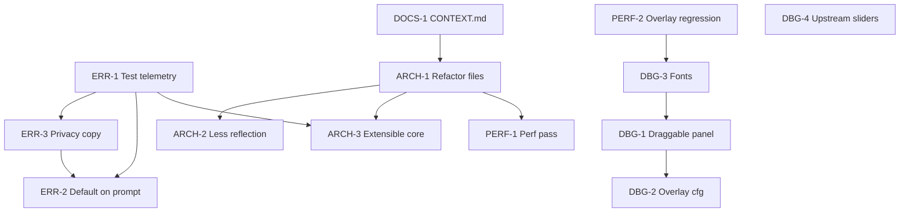

# Dread roadmap / backlog

Planned work tracked as GitHub issues. See `docs/agents/issue-tracker.md` for CLI conventions.

**Status key:** `idea` = not started, `in-progress` = active branch, `blocked` = needs upstream or design decision, `done` = shipped (close issue + update CHANGELOG).

**Priority key:**

| Priority | Meaning |
|----------|---------|
| **P0** | Do first: blocks other work, legal/product risk, or core stability |
| **P1** | Do soon: high value after P0 gates |
| **P2** | Polish: UX and performance after structure is stable |
| **P3** | Later or blocked: upstream dependency or optional cleanup |

---

## Execution order (what to complete first)

Work top to bottom within each phase. Do not skip **Depends on** unless the issue is explicitly closed.

### Already shipped (maintain only)

| ID | Item | Notes |
|----|------|-------|
| (compat) | **REPOConfig slider labels** | Temporary fix in `RepoConfigSliderLabelCompat.cs`; user-verified. Remove when DBG-4 upstream lands. |
| DOCS-1 | **Root `CONTEXT.md`** | Glossary + file map ([#174](https://github.com/grompen91-droid/dreadREPO/issues/174), PR #179) |

### Phase 1: Foundation (start here)

| Order | ID | Priority | Issue | Depends on | Why first |
|-------|-----|----------|-------|------------|-----------|
| 1 | ERR-1 | **P0** | [#171](https://github.com/grompen91-droid/dreadREPO/issues/171) | — | Must prove telemetry works before default-on or public promises |
| 2 | PERF-2 | P1 | [#170](https://github.com/grompen91-droid/dreadREPO/issues/170) | — | Quick regression guard on overlay perf fix already in `master` |

### Phase 2: Structure (before extensibility and large features)

| Order | ID | Priority | Issue | Depends on | Why |
|-------|-----|----------|-------|------------|-----|
| 4 | ARCH-1 | **P0** | [#167](https://github.com/grompen91-droid/dreadREPO/issues/167) | DOCS-1 (soft) | Split god-files; required before ARCH-3 |
| 5 | ARCH-2 | P1 | [#168](https://github.com/grompen91-droid/dreadREPO/issues/168) | ARCH-1 (soft) | Fewer reflection paths; easier stub/full builds |

### Phase 3: Harden core and telemetry product

| Order | ID | Priority | Issue | Depends on | Why |
|-------|-----|----------|-------|------------|-----|
| 6 | ARCH-3 | **P0** | [#175](https://github.com/grompen91-droid/dreadREPO/issues/175) | ARCH-1, ERR-1 (soft) | Extensibility + fail-safe init; defines how new systems land |
| 7 | ERR-3 | P1 | [#173](https://github.com/grompen91-droid/dreadREPO/issues/173) | ERR-1 | Privacy copy required before opt-out default changes |
| 8 | ERR-2 | P1 | [#172](https://github.com/grompen91-droid/dreadREPO/issues/172) | ERR-1, ERR-3 | Default-on + first-run prompt only after tests and copy |

### Phase 4: Debug overlay polish

| Order | ID | Priority | Issue | Depends on | Why |
|-------|-----|----------|-------|------------|-----|
| 9 | DBG-3 | P2 | [#165](https://github.com/grompen91-droid/dreadREPO/issues/165) | PERF-2 | Font/legibility (user feedback: labels look odd vs toggles) |
| 10 | DBG-1 | P2 | [#163](https://github.com/grompen91-droid/dreadREPO/issues/163) | DBG-3 (soft) | Draggable panel after text renders reliably |
| 11 | DBG-2 | P2 | [#164](https://github.com/grompen91-droid/dreadREPO/issues/164) | DBG-1 (soft) | Richer cfg once layout UX is settled |

### Phase 5: Performance optimization

| Order | ID | Priority | Issue | Depends on | Why |
|-------|-----|----------|-------|------------|-----|
| 12 | PERF-1 | P2 | [#169](https://github.com/grompen91-droid/dreadREPO/issues/169) | ARCH-1, PERF-2 | Profile stable codebase; avoid optimizing files about to move |

### Phase 6: Upstream / cleanup

| Order | ID | Priority | Issue | Depends on | Why |
|-------|-----|----------|-------|------------|-----|
| 13 | DBG-4 | P3 | [#166](https://github.com/grompen91-droid/dreadREPO/issues/166) | REPOConfig or MenuLib fix | Remove temporary slider compat; **blocked** on upstream |

---

## Debug overlay

| ID | Priority | Item | Notes | Status | Issue |
|----|----------|------|-------|--------|-------|
| DBG-1 | P2 | **Refine debug panel UX** | Draggable panel, resize/snap, clearer layout | idea | [#163](https://github.com/grompen91-droid/dreadREPO/issues/163) |
| DBG-2 | P2 | **Richer overlay configuration** | Forgiving defaults; cfg/REPOConfig layout | idea | [#164](https://github.com/grompen91-droid/dreadREPO/issues/164) |
| DBG-3 | P2 | **Font fixes** | Proton/Linux font fallback and sizing | idea | [#165](https://github.com/grompen91-droid/dreadREPO/issues/165) |
| DBG-4 | P3 | **REPOConfig slider labels (upstream)** | Remove `RepoConfigSliderLabelCompat` | blocked | [#166](https://github.com/grompen91-droid/dreadREPO/issues/166) |

See also: `docs/repo-config-slider-labels-investigation.md`.

---

## Architecture and dependencies

| ID | Priority | Item | Notes | Status | Issue |
|----|----------|------|-------|--------|-------|
| ARCH-1 | P0 | **Refactor into manageable files** | Split large systems; thin `Plugin` / `DreadSystemInitializer` | idea | [#167](https://github.com/grompen91-droid/dreadREPO/issues/167) |
| ARCH-2 | P1 | **Reduce DLL / reflection surface** | Compile-time refs; document stub vs full build | idea | [#168](https://github.com/grompen91-droid/dreadREPO/issues/168) |
| ARCH-3 | P0 | **Extensibility + hardened core** | Extension points, fail-safe init, compat patterns | idea | [#175](https://github.com/grompen91-droid/dreadREPO/issues/175) |

---

## Performance

| ID | Priority | Item | Notes | Status | Issue |
|----|----------|------|-------|--------|-------|
| PERF-1 | P2 | **Performance pass** | Profile overlay, tension/audio, enemy cache, Harmony | idea | [#169](https://github.com/grompen91-droid/dreadREPO/issues/169) |
| PERF-2 | P1 | **Overlay when hidden** | Verify no `OnGUI` when HUD hidden | idea | [#170](https://github.com/grompen91-droid/dreadREPO/issues/170) |

---

## Error reporting and telemetry

| ID | Priority | Item | Notes | Status | Issue |
|----|----------|------|-------|--------|-------|
| ERR-1 | P0 | **Test error reporting end-to-end** | TestCrash, MCP, real exceptions (ADR-0010) | idea | [#171](https://github.com/grompen91-droid/dreadREPO/issues/171) |
| ERR-2 | P1 | **Default on + first-run prompt** | Default `ErrorReportingEnabled` true | idea | [#172](https://github.com/grompen91-droid/dreadREPO/issues/172) |
| ERR-3 | P1 | **Privacy copy** | In-game text: what is sent, how to disable | idea | [#173](https://github.com/grompen91-droid/dreadREPO/issues/173) |

**Current behavior:** `ErrorReportingEnabled` defaults to **false** (opt-in). Ship ERR-2 only after ERR-1 and ERR-3.

---

## Documentation and agent context

| ID | Priority | Item | Notes | Status | Issue |
|----|----------|------|-------|--------|-------|
| DOCS-1 | P1 | **Add root `CONTEXT.md`** | Glossary + bounded context for agents | done | [#174](https://github.com/grompen91-droid/dreadREPO/issues/174) |

---

## How to use this file

1. Pick the next row from **Execution order** (lowest order number not `done`).
2. Work the linked GitHub issue; reference roadmap ID in PR body (`ARCH-1`, etc.).
3. When shipped: close issue, update `CHANGELOG.md` `[Unreleased]`, mark `done` here.
4. Agents: read [`CONTEXT.md`](../CONTEXT.md) and `docs/agents/domain.md` before implementing.

**Suggested first three issues for a new contributor:** #171 (ERR-1), #170 (PERF-2), #167 (ARCH-1).
