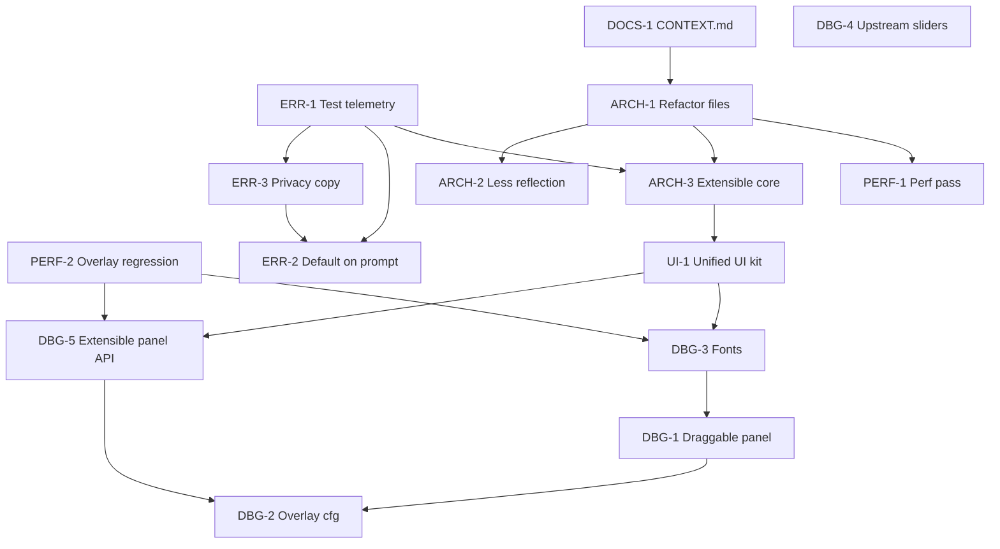

# Dread roadmap / backlog

Planned work tracked as GitHub issues. See `docs/agents/issue-tracker.md` for CLI conventions.

**Status key:** `idea` = not started, `in-progress` = active branch, `blocked` = needs upstream or design decision, `done` = shipped (close issue + update CHANGELOG).

**Priority key:**

| Priority | Meaning |
|----------|---------|
| **P0** | Do first: blocks other work, legal/product risk, or core stability |
| **P1** | Do soon: high value after P0 gates |
| **P2** | Polish: UX and performance after structure is stable |
| **P3** | Later or blocked: upstream dependency or optional cleanup |

---

## Execution order (what to complete first)

Work top to bottom within each phase. Do not skip **Depends on** unless the issue is explicitly closed.

### Already shipped (maintain only)

| ID | Item | Notes |
|----|------|-------|
| (compat) | **REPOConfig slider labels** | `RepoConfigSliderLabelCompat` when REPOConfig is loaded: restores names at x=100, compact row. Names readable; left-column alignment vs toggles still imperfect. **Do not remove** until DBG-4 upstream or verified A/B without compat. |
| DOCS-1 | **Root `CONTEXT.md`** | Glossary + file map ([#174](https://github.com/grompen91-droid/dreadREPO/issues/174), PR #179) |
| AUDIO-1 | **Audio playback + stub UWR hardening** | `AudioPlayUtil` (pitch-aware destroy); NVorbis read-until-EOF; `UnityWebRequestCompat`; error reporter batch POST via `HttpWebRequest`; psychotic break no longer `Destroy`s cached clips. PR #203. See `docs/agents/guides/audio-dread-and-loading.md` |
| ARCH-1 | **File split** | `Systems/Patches/`, `PsychoticBreak/`, `ErrorReporting/`, `DebugOverlay/`. PR [#201](https://github.com/grompen91-droid/dreadREPO/pull/201) |
| ARCH-2 | **Reflection inventory + stub/full docs** | PR [#202](https://github.com/grompen91-droid/dreadREPO/pull/202) |
| ARCH-3 | **`DreadSystemRegistry` + fail-safe init** | PR [#204](https://github.com/grompen91-droid/dreadREPO/pull/204); ADR-0016 |
| ERR-3 | **Privacy disclosure copy** | PR [#207](https://github.com/grompen91-droid/dreadREPO/pull/207) |
| ERR-2 | **Default-on + first-run prompt** | PR [#208](https://github.com/grompen91-droid/dreadREPO/pull/208) |
| DEV-1 | **Repo hygiene** | GPL-3.0 `LICENSE`, `SECURITY.md`, Dependabot, CodeQL on stubs. PR [#194](https://github.com/grompen91-droid/dreadREPO/pull/194) |
| DEV-2 | **Toolchain deps** | Vitest 4 + `cloudflareTest()` (#200); Zod 4 + TS 6 MCP (#195, #198); GitHub Actions v6/v7 (#196). Dependabot #197/#199 closed (Vitest 4 required config migration) |

### 2026-05-29 merge log (reference)

| PR | Author | Summary |
|----|--------|---------|
| [#194](https://github.com/grompen91-droid/dreadREPO/pull/194) | agent | GPL-3.0, tailored Dependabot/SECURITY, CodeQL C# stub build |
| [#195](https://github.com/grompen91-droid/dreadREPO/pull/195)-[#198](https://github.com/grompen91-droid/dreadREPO/pull/198) | dependabot | zod 4, GitHub Actions, MCP tooling (TS 6) |
| [#200](https://github.com/grompen91-droid/dreadREPO/pull/200) | agent | Vitest 4 + Cloudflare pool 0.16 + `vitest.config.mts` |
| [#201](https://github.com/grompen91-droid/dreadREPO/pull/201) | noxaur | ARCH-1 god-file split |
| [#202](https://github.com/grompen91-droid/dreadREPO/pull/202) | noxaur | ARCH-2 reflection reductions |
| [#203](https://github.com/grompen91-droid/dreadREPO/pull/203) | noxaur | Audio lifetime + stub UWR |
| [#204](https://github.com/grompen91-droid/dreadREPO/pull/204) | noxaur | ARCH-3 system registry |
| [#207](https://github.com/grompen91-droid/dreadREPO/pull/207) | noxaur | ERR-3 privacy copy |
| [#208](https://github.com/grompen91-droid/dreadREPO/pull/208) | noxaur | ERR-2 default-on + prompt |

### Phase 1: Foundation (FINISHED)

| Order | ID | Priority | Issue | Depends on | Why first |
|-------|-----|----------|-------|------------|-----------|
| 1 | ERR-1 | **P0** | [#171](https://github.com/grompen91-droid/dreadREPO/issues/171) | None | Must prove telemetry works before default-on or public promises |
| 2 | PERF-2 | P1 | [#170](https://github.com/grompen91-droid/dreadREPO/issues/170) | None | Done: component disabled when off; guard + manual checklist |

### Phase 2: Structure (FINISHED)

| Order | ID | Priority | Issue | Depends on | Status |
|-------|-----|----------|-------|------------|--------|
| 4 | ARCH-1 | **P0** | [#167](https://github.com/grompen91-droid/dreadREPO/issues/167) | DOCS-1 (soft) | done (#201) |
| 5 | ARCH-2 | P1 | [#168](https://github.com/grompen91-droid/dreadREPO/issues/168) | ARCH-1 (soft) | done (#202) |

### Phase 3: Harden core and telemetry product (FINISHED)

| Order | ID | Priority | Issue | Depends on | Status |
|-------|-----|----------|-------|------------|--------|
| 6 | ARCH-3 | **P0** | [#175](https://github.com/grompen91-droid/dreadREPO/issues/175) | ARCH-1, ERR-1 (soft) | done (#204) |
| 7 | ERR-3 | P1 | [#173](https://github.com/grompen91-droid/dreadREPO/issues/173) | ERR-1 | done (#207) |
| 8 | ERR-2 | P1 | [#172](https://github.com/grompen91-droid/dreadREPO/issues/172) | ERR-1, ERR-3 | done (#208) |

### Phase 4: Player-facing UI and debug overlay polish (active)

| Order | ID | Priority | Issue | Depends on | Why |
|-------|-----|----------|-------|------------|-----|
| 9 | UI-1 | P2 | (to file) | ARCH-3 (soft) | Shared Dread UI kit (theme, modal, scroll body, buttons, cursor/input capture) as a reusable `MonoBehaviour` component so prompts, F10 overlay, and future panels do not each reimplement IMGUI layout |
| 10 | DBG-5 | P2 | (to file) | PERF-2, UI-1 (soft) | Extensible panel API: register overlay sections/rows without editing `DebugOverlaySystem`; build on UI-1 primitives where possible |
| 11 | DBG-3 | P2 | [#165](https://github.com/grompen91-droid/dreadREPO/issues/165) | PERF-2, UI-1 (soft) | Font/legibility (user feedback: labels look odd vs toggles) |
| 12 | DBG-1 | P2 | [#163](https://github.com/grompen91-droid/dreadREPO/issues/163) | DBG-3 (soft) | Draggable panel after text renders reliably |
| 13 | DBG-2 | P2 | [#164](https://github.com/grompen91-droid/dreadREPO/issues/164) | DBG-1, DBG-5 (soft) | Richer cfg once layout UX is settled |

### Phase 5: Performance optimization (PAUSED)

| Order | ID | Priority | Issue | Depends on | Why |
|-------|-----|----------|-------|------------|-----|
| 14 | PERF-1 | P2 | [#169](https://github.com/grompen91-droid/dreadREPO/issues/169) | ARCH-1, PERF-2 | Profile stable codebase; avoid optimizing files about to move |

### Phase 6: Upstream / cleanup

| Order | ID | Priority | Issue | Depends on | Why |
|-------|-----|----------|-------|------------|-----|
| 15 | DBG-4 | P3 | [#166](https://github.com/grompen91-droid/dreadREPO/issues/166) | REPOConfig or MenuLib fix | Remove temporary slider compat; **blocked** on upstream |

---

## Player-facing UI

| ID | Priority | Item | Notes | Status | Issue |
|----|----------|------|-------|--------|-------|
| UI-1 | P2 | **Unified Dread UI kit** | Component-driven in-game UI module shared across features: REPO-style theme (dark panel, accent typography), modal overlay with cursor unlock and gameplay input lock, scrollable body with correct `CalcHeight` line layout, and standard action buttons. First consumers: error-reporting first-run prompt and F10 debug overlay; later panels plug in without copy-pasting IMGUI math. Design as internal `MonoBehaviour` + small API surface first; optional registration hooks for other Dread systems when ARCH-3 patterns settle. | idea | (to file) |

---

## Debug overlay

| ID | Priority | Item | Notes | Status | Issue |
|----|----------|------|-------|--------|-------|
| DBG-1 | P2 | **Refine debug panel UX** | Draggable panel, resize/snap, clearer layout | idea | [#163](https://github.com/grompen91-droid/dreadREPO/issues/163) |
| DBG-2 | P2 | **Richer overlay configuration** | Forgiving defaults; cfg/REPOConfig layout | idea | [#164](https://github.com/grompen91-droid/dreadREPO/issues/164) |
| DBG-3 | P2 | **Font fixes** | Proton/Linux font fallback and sizing | idea | [#165](https://github.com/grompen91-droid/dreadREPO/issues/165) |
| DBG-4 | P3 | **REPOConfig slider labels (upstream)** | Remove `RepoConfigSliderLabelCompat` after REPOConfig/MenuLib pass descriptions or match toggle layout. Optional Dread polish (left align) only if compat stays; pivot/alignment experiments reverted 2026-05-30 | blocked | [#166](https://github.com/grompen91-droid/dreadREPO/issues/166) |
| DBG-5 | P2 | **Extensible overlay panel API** | Make it trivial for other features to add overlay content without editing `DebugOverlaySystem`: a data-driven section/row registry (e.g. `IOverlayPanel` / `RegisterSection`) supporting read-only rows and interactive controls (toggles/sliders) so settings and future systems plug in. Decouples row data from rendering. | idea | (to file) |

See also: `docs/repo-config-slider-labels-investigation.md`.

---

## Architecture and dependencies

| ID | Priority | Item | Notes | Status | Issue |
|----|----------|------|-------|--------|-------|
| ARCH-1 | P0 | **Refactor into manageable files** | Split large systems; thin `Plugin` / `DreadSystemInitializer` | done | [#167](https://github.com/grompen91-droid/dreadREPO/issues/167) |
| ARCH-4 | P3 | **External mod API + feature modules** | Optional cfg feature packs; documented BepInEx soft-dependency API; semver + ADR; after ARCH-3 | idea | (to file) |
| ARCH-2 | P1 | **Reduce DLL / reflection surface** | Compile-time refs; document stub vs full build | done | [#168](https://github.com/grompen91-droid/dreadREPO/issues/168) |
| ARCH-3 | P0 | **Extensibility + hardened core** | Extension points, fail-safe init, compat patterns | done | [#175](https://github.com/grompen91-droid/dreadREPO/issues/175) (`specs/002-arch-3-extensible-core/`) |

---

## Performance

| ID | Priority | Item | Notes | Status | Issue |
|----|----------|------|-------|--------|-------|
| PERF-1 | P2 | **Performance pass** | Profile overlay, tension/audio, enemy cache, Harmony | idea | [#169](https://github.com/grompen91-droid/dreadREPO/issues/169) |
| PERF-2 | P1 | **Overlay when hidden** | Component disabled when off (no `Update`/`OnGUI`); guard + checklist `docs/agents/overlay-perf-checklist.md` | done | [#170](https://github.com/grompen91-droid/dreadREPO/issues/170) |

---

## Error reporting and telemetry

| ID | Priority | Item | Notes | Status | Issue |
|----|----------|------|-------|--------|-------|
| ERR-1 | P0 | **Test error reporting end-to-end** | TestCrash, MCP, real exceptions (ADR-0010, ADR-0012, ADR-0015); checklist in `docs/agents/error-reporting-test-checklist.md` | done | [#171](https://github.com/grompen91-droid/dreadREPO/issues/171) |
| ERR-2 | P1 | **Default on + first-run prompt** | Default `ErrorReportingEnabled` true; `ErrorReportingPromptSystem` + consent gate | done | [#172](https://github.com/grompen91-droid/dreadREPO/issues/172) (PR #208) |
| ERR-2b | P1 | **Core error capture fix** | `Systems/Core/` + `EnemyHealthCompat` for report payloads (no `get_CurrentHealth`) | in review | PR #213 (`004-err-2-default-on-prompt`) |
| ERR-3 | P1 | **Privacy copy** | Canonical disclosure + cfg description; ERR-2 uses same strings | done | [#173](https://github.com/grompen91-droid/dreadREPO/issues/173) (PR #207, `specs/003-err-3-privacy-copy/`) |
| ERR-4 | P2 | **Non-blocking batch flush** | `SendBatch` uses sync `HttpWebRequest` on main thread (up to 15s). Prefer `UnityWebRequest` when `UnityWebRequestCompat.IsUsable`, else background thread. Narrow `ShouldIgnoreUnityLog` if we need non-UWR `BadImageFormatException` reports | idea | (to file) |

**Current behavior:** `ErrorReportingEnabled` defaults to **true** for new cfg. First gameplay level shows one-time prompt; no upload until acknowledged. Upgrades keep saved `false`. Batch flush: `ErrorReportUploader.TryPostPayloadSync` (ADR-0015). Core capture fix pending in PR #213.

---

## Audio and atmosphere

| ID | Priority | Item | Notes | Status | Issue |
|----|----------|------|-------|--------|-------|
| AUDIO-1 | P1 | **Pitch-aware playback + NVorbis EOF + stub UWR** | `AudioPlayUtil`; chunked NVorbis; `UnityWebRequestCompat`; shared clip cache safe in psychotic break | done | PR #203 |
| AUDIO-2 | P2 | **Unit tests for `AudioPlayUtil`** | Golden cases: pitch 0.5 doubles wall-clock lifetime; edge pitch clamp | idea | (to file) |
| AUDIO-3 | P2 | **NVorbis load performance** | Replace per-sample `List.Add` with block copy for large OGGs; handle partial final frame if needed | idea | (to file) |
| AUDIO-4 | P2 | **`PlayPeakScream` DRY** | Use `AudioPlayUtil` for destroy timing (pitch fixed at 1.0 today) | done | PR #203 (`PlayPeakScream`) |

Stub/local builds: always use real game `Managed` DLLs for release packages when possible (`build.ps1` warns on stub-only compile). CI may still use stubs; NVorbis is the primary audio path.

---

## Documentation and agent context

| ID | Priority | Item | Notes | Status | Issue |
|----|----------|------|-------|--------|-------|
| DOCS-1 | P1 | **Add root `CONTEXT.md`** | Glossary + bounded context for agents | done | [#174](https://github.com/grompen91-droid/dreadREPO/issues/174) |

---

## How to use this file

1. Pick the next row from **Execution order** (lowest order number not `done`).
2. Work the linked GitHub issue; reference roadmap ID in PR body (`ARCH-1`, etc.).
3. When shipped: close issue, update `CHANGELOG.md` `[Unreleased]`, mark `done` here.
4. Agents: start at [`docs/agents/README.md`](agents/README.md), then [`CONTEXT.md`](../CONTEXT.md), [`docs/agents/domain.md`](agents/domain.md), and [`docs/agents/orchestration.md`](agents/orchestration.md) before implementing.

**Suggested first three issues for a new contributor:** #165 (DBG-3 fonts), #169 (PERF-1), #163 (DBG-1 draggable panel). File UI-1 on GitHub before starting overlay extensibility work.
