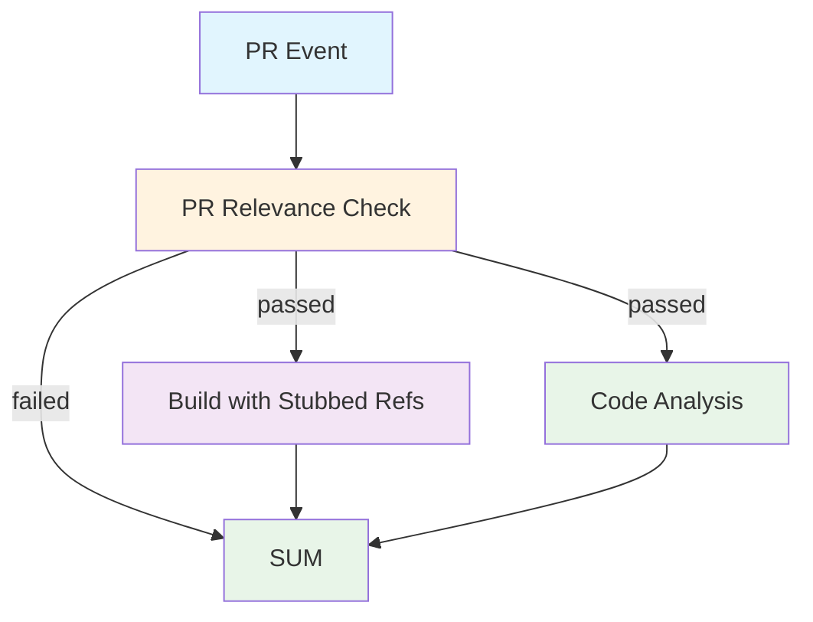

## Workflow Overview

**Purpose**: Verify pull requests for the Dread REPO mod compile correctly against stubbed game references, pass code analysis, and produce a printable summary.
**Trigger Events**: PR opened, synchronized (new commits), reopened, edited
**Target Environments**: Windows (build), Ubuntu (relevance, analysis, summary)

## Execution Flow Diagram



## Jobs & Dependencies

| Job Name | Purpose | Dependencies | Execution Context |
|----------|---------|--------------|-------------------|
| relevance | Validate PR title/body/files are project-relevant | None | ubuntu-latest, 5m timeout |
| build | Compile Dread.dll against synthesized stub assemblies | relevance (passed) | windows-latest, 15m timeout |
| analyze | Check formatting and common C# anti-patterns | relevance (passed, parallel with build) | ubuntu-latest, 5m timeout |
| summary | Aggregate job results into a table; fail on any failure | relevance, build, analyze | ubuntu-latest, 3m timeout |

## Requirements Matrix

### Functional Requirements
| ID | Requirement | Priority | Acceptance Criteria |
|----|-------------|----------|-------------------|
| REQ-001 | Build must succeed without real game DLLs | High | dotnet build exits 0 with only stubs + BepInEx |
| REQ-002 | Relevance gate blocks non-project PRs from consuming resources | High | Build and analyze skipped when relevance outputs.passed == False |
| REQ-003 | Format check catches style violations | Low | dotnet-format --verify-no-changes reports 0 diffs |
| REQ-004 | Summary prints a table of all job results and exits 1 on failure | Medium | Output rows for relevance, build, analysis; exit 1 if any failed |

### Security Requirements
| ID | Requirement | Implementation Constraint |
|----|-------------|---------------------------|
| SEC-001 | No secrets checked in or exposed | Token only uses `contents: read`, `metadata: read`, `packages: read` |
| SEC-002 | OAuth token scoped to pull_request event | Workflow cannot push or modify outside PR context |

### Performance Requirements
| ID | Metric | Target | Measurement Method |
|----|-------|--------|-------------------|
| PERF-001 | End-to-end runtime | < 12 min | Aggregate wall-clock across all jobs |
| PERF-002 | Stub generation | < 3 min | Time from gen-stubs.ps1 start to finish |

## Input/Output Contracts

### Inputs

```yaml
# Trigger
pr_title: string       # From github.event.pull_request.title
pr_body: string        # From github.event.pull_request.body
pr_author: string      # From github.event.pull_request.user.login
changed_files: list    # From git diff --name-only base...HEAD

# Environment Variables (injected by GitHub)
DOTNET_ROOT: string    # .NET SDK root (set by actions/setup-dotnet)
```

### Outputs

```yaml
# Artifacts (conditional)
Dread-CI-DLL: file       # bin/Release/net48/Dread.dll (only on success)
build-log: text          # Full MSBuild output (only on failure)

# Workflow-level
summary_table: string   # Printed as markdown in the final step
```

### Secrets & Variables

| Type | Name | Purpose | Scope |
|------|------|---------|-------|
| Token | GITHUB_TOKEN | Default checkout/API token | Workflow (read-only) |

## Execution Constraints

### Runtime Constraints
- **Timeout**: 15m global max (build), 5m per lightweight job
- **Concurrency**: Grouped by `ci-${{ github.ref }}`; new push cancels in-flight
- **Resource Limits**: Standard GitHub-hosted runner (2 vCPU, 7GB RAM for Windows)

### Environmental Constraints
- **Runner Requirements**: Windows for build (NET48 targeting pack via MAUI workload), Linux for scripted jobs
- **Network Access**: GitHub Releases (BepInEx download), NuGet.org (package restore)
- **Permissions**: `contents: read`, `metadata: read`, `packages: read` (no write)

## Error Handling Strategy

| Error Type | Response | Recovery Action |
|------------|----------|-----------------|
| Relevance failure | Build/analyze skipped; summary shows "skipped" | Human reviews PR relevance |
| Stub compilation fail | Build paused due to cache miss; download fails | Fix gen-stubs.ps1 and re-push |
| Build failure | Upload full MSBuild log as artifact | Read artifact to diagnose |
| Analyze formatting fail | Summary exits 1; warning emitted | Human formats and re-pushes |
| Analyze code issue fail | Summary exits 1; warning emitted | Fix C# issues and re-push |
| Summary failure | exit 1; PR check fails | Fix summary script or re-run |

## Quality Gates

### Gate Definitions

| Gate | Criteria | Bypass Conditions |
|------|----------|-------------------|
| Relevance | Title + files contain project keywords | None (hard gate: build/analyze skipped if failed) |
| Build | dotnet build exit code 0 | None |
| Formatting | dotnet-format --verify-no-changes exit code 0 | None (summary exits 1 on failure) |

## Monitoring & Observability

### Key Metrics
- **Success Rate**: Target > 90% build pass rate
- **Execution Time**: Build should complete in < 8 min typical
- **Resource Usage**: MAUI workload cache hit rate (target > 50%)

### Alerting

| Condition | Severity | Notification Target |
|-----------|----------|-------------------|
| Build failure on master PR | Medium | PR author (GitHub) |
| Relevance false-negative | Low | PR author (GitHub) |

## Integration Points

### External Systems

| System | Integration Type | Data Exchange | SLA Requirements |
|--------|------------------|---------------|------------------|
| GitHub Releases | HTTP download | BepInEx zip (~4MB) | Standard GitHub SLA |
| NuGet.org | Package restore | .NET packages | Standard NuGet SLA |

### Dependent Workflows

| Workflow | Relationship | Trigger Mechanism |
|----------|--------------|-------------------|
| N/A | N/A | N/A |

## Compliance & Governance

### Audit Requirements
- **Execution Logs**: Retained by GitHub Actions for 90 days
- **Approval Gates**: None (auto-triggered on PR)
- **Change Control**: Workflow + scripts versioned in repo

### Security Controls
- **Access Control**: GITHUB_TOKEN scoped to `pull_request` event
- **Secret Management**: No custom secrets required
- **Vulnerability Scanning**: None (out of scope for this workflow)

## Edge Cases & Exceptions

### Scenario Matrix

| Scenario | Expected Behavior | Validation Method |
|----------|-------------------|-------------------|
| PR from fork | Workflow runs but checkout uses fork ref | Manual test |
| PR with only docs/ changes | Relevance passes (docs/ is whitelisted); build + analyze run | Unit test on check-relevance |
| Non-project PR (no keywords, no matching files) | Relevance fails; build/analyze skipped; summary prints "skipped" | Create test PR with random title |
| Consecutive pushes to same PR | Previous run cancelled; new run starts | Observability |
| BepInEx download fails | gen-stubs emits warning; build attempts without BepInEx | Log inspection |
| Stub compilation fails | Build job aborts; upload-log artifact missing | Log inspection |
| Build succeeds before MAUI workload install | Cache-hit shortens runtime | Cache hit log |
| MAUI cache stale after stub change | Cache key (gen-stubs.ps1 + csproj hash) differs; fresh install | Update gen-stubs.ps1, verify cache miss |

## Validation Criteria

### Workflow Validation
- **VLD-001**: A PR whose title contains "dread" and touches a .cs file must trigger all 4 jobs
- **VLD-002**: A PR whose title is "fix typo" and touches README.md only must pass relevance
- **VLD-003**: Build must fail with clear MSBuild errors when stubs are missing
- **VLD-004**: Summary must exit 1 when any check fails (build or analysis)

### Performance Benchmarks
- **PERF-001**: Full pipeline (relevance + build + analysis + summary) completes in < 12 min
- **PERF-002**: MAUI workload install (cache miss) takes < 3 min

## Change Management

### Update Process
1. **Specification Update**: Modify this document first
2. **Review & Approval**: PR against master with description of change
3. **Implementation**: Apply changes to `.github/workflows/ci.yml` and/or `.github/scripts/`
4. **Testing**: Create a test PR branch and verify all 4 jobs
5. **Deployment**: Merge to master

### Version History

| Version | Date | Changes | Author |
|---------|------|---------|--------|
| 1.0 | 2026-05-21 | Initial specification | Grompen91 |
| 1.1 | 2026-05-21 | Relevance is now a hard gate; analyze runs parallel with build; MAUI cache key uses stub/project hash; summary checks all jobs; packages:read permission added | noxaur |
| 1.2 | 2026-05-22 | Analyze job now respects relevance gate (if: condition); summary treats "skipped" as success; MAUI cache expanded to full packs/ dir; gen-stubs parallelized empty stub compilation; PowerShell version guard for 5.1 compat | noxaur |

## Related Specifications

- [gen-stubs.ps1](../.github/scripts/gen-stubs.ps1): stub generation logic
- [check-relevance.ps1](../.github/scripts/check-relevance.ps1): relevance check logic
- [Dread.csproj](../Dread.csproj): target project reference layout
